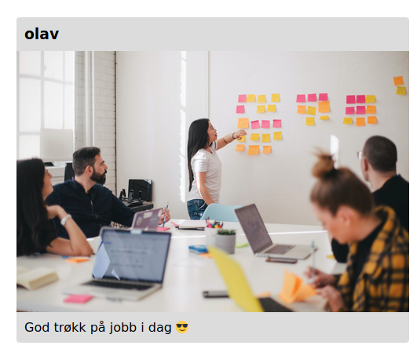

# Introduksjon

En workshop som kan hjelpe deg i gang med webprogrammering.
Workshopen inneholder oppgaver for å lære HTML, CSS og JavaScript.

## Oppslagsverk

Vi har også laget en [GitBook](https://bekk.gitbook.io/web-intro/) som du gjerne må bruke som oppslagsverk underveis om det er noe du lurer på.

## Emoji-guide

Du kommer til å se noen emojis i oppgavene 🤩 De betyr det her:

- 🏆 Oppgave: Her er hva du skal gjøre
- 💡 Tips: Litt ekstra info som kan være greit å vite for og løse en oppgave
- 🚨 Løsningsforslag: Her finner du en komplett gjennomgang av hvordan du _kan_ løse oppgaven
- 🤓 Fun facts: Ekstrainfo for de spesielt interesserte

# TODO

Lag en "komme i gang"-seksjon her! Tilbakemelding fra tidligere:

"En ting som kunne vært nyttig er en sånn "komme i gang" seksjon der det står at man må klone repoet, åpne index.html i en nettleser og hvilken fil oppgavene skal løses i. Jeg fikk først for meg at de kanskje skulle løses inne i oppgaver mappen et sted "

## Mappestruktur

I dette repoet finner du to mapper: `src` og `løsningsforslag`. Mappen src kan du bruke som når du jobber med oppgavene, du kan endre filene som allerede finnes her eller opprette dine egne. I src finner du også en mappe som heter images, hvor du finner bilder som kan brukes i Bekkstagram.

# HTML og CSS

## Header-elementer

HTML-dokumenter inneholder en rekke elementer som enten er self-closing (altså lukker seg selv) eller som har underelementer, ofte referert til som children.

Et element defineres med en _tag_. En tag ser slik ut `<tag>`. En tag markerer starten eller slutten på elementet, med innholdet i midten: `<tag> innhold </tag>`. Eventuelt er tagen self-closing: `<tag />`

Det finnes mange forskjellige tags som har som oppgave å få siden til å se ut som man vil.

Vi har `<p>` for å definere avsnitt, `<h1>` for overskrifter (og `<h2>`, `<h3>` osv. for mindre overskrifter), `<li>` for lister, og `<div>` for å definere områder innen HTML-koden. Disse er bare noen få eksempler.

🏆 Lag en overskrift som sier "Hello world!"

💡 Du kan skrive koden inn i `<body>`-elementet i den inkluderte filen.

<details><summary>🚨 Løsningsforslag</summary>
Body-elementet ditt skal se sånn ut:

```html
<body>
  <h1>Hello World!</h1>
</body>
```

</details>

## Bilde

Bilder representeres med taggen `` i HTML. Et attributt er noe som gir mer informasjon om et HTML-element og ligger inne i en tag (på innsiden av `<` og `>`). Attributtet `src` forteller nettleseren hvor den kan hente bildet. I vårt tilfelle vil dette være en lokal fil.

```html

```

> Det er viktig å beskrive bilde med `alt`-attributtet, slik at skjermlesere og andre verktøy kan presentere det riktig for brukeren.

🏆 Legg til bildet `working.jpg` i `index.html`. Du finner bildet i mappen [`img`](./src/img/).

<details><summary>🚨 Løsningsforslag</summary>
Alle HTML-elementer kan ha attributter. Disse kan brukes til å gi tilleggsinformasjon om et element. I vårt tilfelle bruker vi `src`-attributtet til å spesifisere filstien til bildet.

```html

```

</details>

## CSS - Cascading Style Sheets

CSS er verktøyet vi bruker for å gi HTML det utseendet vi ønsker. Hvor ting skal ligge i forhold til hverandre på siden, farger, font, og bakgrunn er ting man setter i CSS.

> Litt på siden, så er CSS en norsk oppfinnelse 💪

Man kan sette styling direkte på et HTML-element, men den vanligste måten å style på er å ha CSS-koden i en egen fil.

HTML-elementer har ofte et `class`-attributt, som kan deles av flere elementer. De kan også ha et `id`-attributt, som er unik per element. CSS bruker `class`-attributt og `id`-attributt for å referere til elementer.

Klasser refereres til med punktum før klassenavnet i CSS.
For eksempel: `<p class="avsnitt">Hei</p>` vil refereres til med følgende CSS-regel:

```css
.avsnitt {
  /* Din stilsetting */
}
```

ID refereres til med nummertegn (#) før id-navnet i CSS.
For eksempel: `<p id="avsnitt">Hei</p>` vil refereres til med følgende CSS-regel:

```css
#avsnitt {
  /* Din stilsetting */
}
```

📚 Se også [oppslagsverket](https://bekk.gitbook.io/web-intro/grunnleggende-webutvikling/cover-2) for mer informasjon om selectorer, pseudo-klasser og box-model .

🏆 Lag en ny fil `index.css`, eller bruk den som ligger i `src`-mappen fra før. Sett inn en referanse til CSS-filen fra `index.html` slik at du kan bruke denne til å style siden din. Med CSS, midtstill overskriften din og gjør teksten rød.

💡 Du _kan_ skrive CSS direkte inn i HTML med `<style>`-taggen, men dette blir fort rotete, og derfor skriver vi som oftest CSS-koden i en egen fil. For at koden skal gjelde for nettsiden din må filen refereres fra `<head>`-taggen i HTML på følgende måte:

```html
<head>
  <link rel="stylesheet" href="./index.css" />
</head>
```

💡 Les på [MDN-artikkelen](https://developer.mozilla.org/en-US/docs/Web/CSS/text-align) om `text-align`.

<details><summary>🚨 Løsningsforslag</summary>

```css
/* index.css */
.overskrift {
  text-align: center;
  color: red;
}
```

</details>

## Gjør det vakkert med CSS ✨

Okey, nå har vi en overskrift og et bilde! Elementene er der, men de ser kanskje ikke så vakre ut...

En post på Bekkstagram består av hvem som har lastet den opp, et bilde og en beskrivelse av bildet. Dette kan representeres med HTML-koden nedenfor:

```html
<main>
  <h1>Bekkstagram</h1>
  <article class="post">
    <h3 class="author">Olav</h3>
    
    <p class="description">
      God trøkk på jobb i dag
      <span role="img" aria-label="Emoji med solbriller">😎</span>
    </p>
  </article>
</main>
```

🏆 Erstatt innholdet i `body`-elementet med HTML-koden over. Bruk så CSS og følg stegene nedenfor for å gjenskape bildet som vist under.

1. Sett en maksbredde på innholdet og sentrer det på midten av siden (Du kan f.eks. style `main`-elementet)
2. Fiks størrelsen på bildet. (Hint: Bredden på bildet er mer enn 100%)
3. Legg på bakgrunnsfarge, rund av hjørnene og legg til litt luft rundt tekstene.

💡 Fargen vi har brukt som bakgrunnsfarge heter `gainsboro`.



<details><summary>🚨 Løsningsforslag</summary>

For å begrense bredden til elementer kan vi bruke `max-width`. La oss f.eks. begrense bredden til `500px`. Noe som er hakket mer magisk er at vi kan sentrere et element horisontalt ved å sette høyre og venstre margin til `auto`.

🤓 Når vi ikke bruker `.` eller `#` foran en CSS-regel refererer vi til en HTML-tag.

```css
main {
  max-width: 500px;
  margin-left: auto;
  margin-right: auto;
}
```

Ved å sette bredden på bildet til å være `100%` passer man på at det ikke blir for stort.

```css
.image {
  width: 100%;
}
```

🤓 Man kan bruke `border-radius` for å runde av hjørnene som vist i skjermbildet. For at tekstene ikke skal være helt i kanten av elementet kan man f.eks. legge på `10px` padding på alle sider (top, bunn, høyre, venstre).

> `padding: 10px;` er en kortere måte å definere padding på alle kanter av et element. Man kunne definert den for hver kant ved å skrive feks. `padding-left: 10px;` osv.

```css
.post {
  background-color: gainsboro;
  border-radius: 5px;
}

.author,
.description {
  padding: 10px;
}
```

🤓 Hvis flere CSS-regler har samme innhold kan man slå de sammen ved å bruke komma før styling-innholdet!

</details>

## Interaktive HTML-komponenter

Frem til nå har vi lagt til statiske HTML-elementer, som viser tekst eller bilder. På vår Bekkstagram ønsker vi at det skal være mulighet for å legge inn kommentarer, samt muligheten for å like et bilde.

Vi skal legge til HTML-elementer for dette, slik at vi har komponentene klare når vi skal bruke JavaScript for å få ting på siden vår til å skje.

- For å kunne like et bilde, trenger vi en knapp.
- For å kunne kommentere på et bilde trenger vi et tekstfelt hvor brukeren kan skrive inn kommentar, i tillegg til en knapp slik at brukeren kan lagre kommentaren sin.

🏆 Sett inn en knapp under beskrivelsen av bildet ditt. Knappen skal ha en 👍-emoji på seg.

💡 Vi ønsker på et senere tidspunkt kunne se hvor mange likes et bilde har fått så det kan være nyttig å legge knappen inn i en egen HTML-bolk med f.eks `<section>`

🏆 Lag en midlertidig seksjon for å vise tidligere kommentarer. Vi skal legge til funksjonaliteten senere så for nå kan du legge inn midlertidig tekst i denne seskjonen.

🏆 Lag et felt hvor brukeren kan skrive inn en kommentar og en knapp slik at brukeren kan lagre kommentaren. Vi skal kun legge inn komponentene i første omgang, funksjonaliteten legger vi på senere.

💡 Tekstfeltet og knappen er knyttet sammen og bør grupperes på et vis. Funksjonaliteten er veldig likt et skjema. Finnes det noen HTML-komponenter for dette?

<details><summary>🚨 Løsningsforslag</summary>

Under vår ``-tag lager vi en ny seksjon. I denne seksjonen vi legger inn en `<button>`-komponent og en placeholder for hvor vi skal vise antall likes

```html
<main>
  <h1>Bekkstagram</h1>
  <article class="post">
    <h3 class="author">olav</h3>
    
    <p class="description">
      God trøkk på jobb i dag
      <span role="img" aria-label="Emoji med solbriller">😎</span>
    </p>
    <section class="post-details">
      <p class="likes">
        Likes: <span id="like-value-1"> 0 </span>
        <button id="like-button-1" class="like-button">
          <span role="img" aria-label="Lik bildet">👍</span>
        </button>
      </p>
    </section>
  </article>
</main>
```

Seksjonen for å vise tidligere kommentarer legger vi under like knappen. Vi har gitt vår seksjon klasse-navnet "comments", og lagt til noen statiske kommentarer som midlertidig innhold. Legg merke til at vi gir de ulike seksjonene et `id` eller `class` attributt for å skille de ulike seksjonene/elementene.

Kommentarfeltet grupperes ved å bruke HTML-elementet `<form>` (skjema). Inne i skjemaet vårt lager vi et tekstfelt og en knapp. Vi bruker `<form>` når vi skal lage en seksjon som inneholder interaktive elementer som skal sende inn informasjon.

```html
<main>
  <h1>Bekkstagram</h1>
  <article class="post">
    <h3 class="author">olav</h3>
    
    <p class="description">
      God trøkk på jobb i dag
      <span role="img" aria-label="Emoji med solbriller">😎</span>
    </p>
    <section class="post-details">
      <p class="likes">
        Likes: <span id="like-value-1"> 0 </span>
        <button id="like-button-1" class="like-button">
          <span role="img" aria-label="Lik bildet">👍</span>
        </button>
      </p>
    </section>
    <section class="comments">
      <article class="comment">
        <p class="comment-user">reidar</p>
        <p class="comment-text">Her jobbes det godt ser jeg!</p>
        <p class="timestamp">5 hours ago</p>
      </article>
      <article class="comment">
        <p class="comment-user">frithjof</p>
        <p class="comment-text">
          La det rulle inn
          <span role="img" aria-label="Emoji med pengemunn">🤑</span>
        </p>
        <p class="timestamp">5 hours ago</p>
      </article>
    </section>
    <form class="comment-form">
      <input placeholder="Add a comment..." value="" id="comment-text-input" />
      <button class="comment-form-button">Post</button>
    </form>
  </article>
</main>
```

</details>

## Navigere til ulike sider

Nå begynner elementene på bilde-siden å komme på plass 🤩 Men hva er vel en webside uten mulighet for navigasjon? På vår Bekkstagram ønsker vi å ha mer enn muligheten for å se et enkelt bilde. Vi ønsker å kunne navigere til en ny side, en feed. Vi skal gjøre mer med dette senere, men foreløpig legger vi inn lenken slik at du kan navigere deg mellom disse sidene.

🏆 Lag en ny .html fil, eller kopier index.html og gi den et nytt navn (eks. feed.html). For å skille mellom de ulike sidene kan du endre title slik at du får en annen tittel på taben. Legg til en lenke på overskriften "Bekkstagram" som navigerer brukeren mellom de to sidene dine.

<details><summary>🚨 Løsningsforslag</summary>

`<a>`-tagen kan brukes til å lage lenker. I vårt tilfelle referer vi til de ulike html-filene våre, men vi kan også få taggen til å referere til eksterne sider som https://www.bekk.no/

```html
<header class="site-header">
  <h1><a href="index.html">Bekkstagram</a></h1>
</header>
```

```html
<header class="site-header">
  <h1><a href="feed.html">Bekkstagram</a></h1>
</header>
```

</details>

# JavaScript

📚 [Les mer i oppslagsverket](https://bekk.gitbook.io/web-intro/grunnleggende-webutvikling/cover-3/06-filer)

## 1) Kjøre JavaScript fra HTML

Den enkleste måten å kjøre JavaScript på siden din, er å skrive koden direkte inni en `<script>`-tag.

🏆 Legg inn en `<script>`-tag i HTML-en sin body, og få den til å vise en _alert_ når du åpner siden.

<details>
<summary>🚨 Løsningsforslag</summary>

Vi legger `<script>`-taggen vår i slutten av `<body>` i `index.html`:

```html
<body>
  ...
  <script>
    alert("Hei fra JavaScript!");
  </script>
</body>
```

</details>

## 2) Referere til ekstern fil

Det blir fort rotete å blande HTML- og Javascript i samme fil. På samme måte som vi kan ha CSS i en egen fil, kan Javascript også flyttes til en egen fil, og lastes inn i HTML-filen for en mer ryddig struktur.

🏆 Flytt JavaScript-koden til en egen fil og referer til denne fra `index.html`.

<details>
<summary>🚨 Løsningsforslag</summary>

Vi legger `<script>`-taggen vår i slutten av `<body>` i `index.html`:

```html
<!-- index.html -->
<body>
  <script type="text/javascript" src="filnavn.js"></script>
</body>
```

```js
// filnavn.js
alert("Hei fra JavaScript!");
```

</details>

## 3) Lytt til klikk på en knapp

Det er litt irriterende at alerten dukker opp hver gang vi laster inn siden på nytt. HTML-siden vår har en _like_-knapp (👍), og vi ønsker å vise alerten først når du trykker på knappen.

### 3a) Få tak i knappen med JavaScript

🏆 Bruk den globale `document`-variabelen for å huke tak i knappen vår ved å bruke metoden `getElementById`. Kall `console.log` på returverdien for å se hva vi får tilbake.

<details>
<summary>🚨 Løsningsforslag</summary>

Like-knappen har ID-en `like-button-1`. Vi kan derfor bruke `document` sin `getElementById`-funksjon med ID-en vår som argument.

```js
const knapp = document.getElementById("like-button-1");
console.log(knapp);
```

</details>

📚 [Les mer om å hente ut noder fra DOM-en](https://bekk.gitbook.io/web-intro/grunnleggende-webutvikling/cover-3/07-dom-apiet#aksessere-html-elementer)

### 3b) Lytte på klikk

Nå har vi fått tak i en referanse til knappen med JavaScript. Det neste steget er å lytte til hendelser som utløses av knappen. Eksempel på hendelser er f.eks. når musepekeren ligger på knappen (`mouseOver`) eller når man trykker på en knapp (`click`).

🏆 Bruk referansen til knappen til å sette på en _event-listener_ som lytter på klikk på knappen.

<details>
<summary>🚨 Løsningsforslag</summary>

Her må vi bruke funksjonen `addEventListener` som ligger på noden vi hentet fra DOM-en. Funksjonen tar inn to argumenter: hendelsen du ønsker å lytte på, i vårt tilfelle `click`; og en funksjon som skal kjøre hver gang hendelsen trigges.

```js
knapp.addEventListener("click", () => {
  alert("Du likte posten!");
});
```

</details>

### 3c) Like et bilde

Gratulerer! Du kan nå like et bilde. Men det ser ikke ut til at antall likes oppdateres? 🤔 Det kan vi gjøre noe med!
Istedenfor å trigge en alert så kan vi oppdatere en teller som holder styr på antall likes bildet har fått når vi klikker på knappen.

🏆 Skriv om slik at knappen viser antall likes og slik at et trykk på knappen legger til flere likes.

<details>
<summary>🚨 Løsningsforslag</summary>

Vi må endre funksjonen som kjøres når vi trykker på knappen slik at den leser ut den gamle verdien, legger til en like og deretter setter denne verdien tilbake i knappen. Dette gjør vi ved å bruke `innerHTML`.

```js
const likeButton = document.getElementById("like-button-1");

likeButton.addEventListener("click", () => {
  likeSpan = document.getElementById("like-value-1");
  likeSpan.innerHTML = Number(likeSpan.innerHTML) + 1;
});
```

</details>

### 3d) Flere likes-knapper

Sånn det er nå fungerer jo kun den ene knappen. Her har vi hardkodet hvilken 👍-boks som skal sjekkes og oppdateres. En litt penere måte å gjøre dette på er å sende inn hvilken 👍-boks vi skal oppdatere. Dette kan vi gjøre ved å kalle funksjonen fra HTMLen.

🏆 Skriv om slik at knappen kaller funksjonen ved bruk av `onclick`, og sender `id`-en til `likeSpan` som argument i en funksjon som oppdaterer like-telleren.

<details>
<summary>🚨 Løsningsforslag</summary>

Her bruker vi `onclick` for å kalle funksjonen rett fra HTMLen, hvor vi enkelt kan sende inn den rette `id`-en.

```html
<button id="like-button-1" class="like-button" onclick="like('like-value-1')">
  <span role="img" aria-label="Lik bildet">👍</span>
</button>
```

```js
function like(likeId) {
  likeSpan = document.getElementById(likeId);
  likeSpan.innerHTML = Number(likeSpan.innerHTML) + 1;
}
```

</details>

📚 [Les mer om hendelser i oppslagsverket](https://bekk.gitbook.io/web-intro/grunnleggende-webutvikling/cover-3/07-dom-apiet#hendelser)

📚 [Les mer om JavaScript-funksjoner i oppslagsverket](https://bekk.gitbook.io/web-intro/grunnleggende-webutvikling/cover-3/04-funksjoner)

## 4) Kommentere et bilde

Nå har du klart å like et bilde, men innimellom er noe så bra at vi også har lyst til å legge igjen en kommentar. Derfor skal vi nå legge på funksjonalitet som gjør at du kan fortelle verden hva du tenker om bildene i feeden. I HTML- og CSS-oppgavene laget vi "skallet" til kommentarboksene, og dette skal vi gjenbruke nå.

## 4a) Få tak i seksjonen med kommentarer

Vi begynner med å bygge et skjelett, før vi legger til mer og mer funksjonalitet etter hvert. Først skal vi hente ut seksjonen med kommentarer, så opprette en ny HTML-artikkel og til slutt legge det nye elementet på seksjonen med kommentarer. For å bryte det ned kan vi begynne med å ta en titt på HTML-syntaksen.

```html
<section class="comments">
  <article class="comment">
    <p class="comment-user">reidar</p>
    <p class="comment-text">Her jobbes det godt ser jeg!</p>
    <p class="timestamp">5 hours ago</p>
  </article>
</section>
<form class="comment-form">
  <input placeholder="Add a comment..." value="" id="comment" />
  <button class="comment-form-button" type="button" onclick="addComment()">
    Post
  </button>
</form>
```

Det vi ser på her er oppbygningen av kommentarseksjonen. Vi vet nå at en kommentar ligger under taggen `<article>`, som inneholder tre `<p>`-tags med informasjon. Og at alle kommentarene ligger under `<section>`-taggen.

For å komme i gang må vi først få tak i denne seksjonen før vi kan modifisere den ved å legge til flere kommentarer.

🤓 Vi har allerede tatt oss friheten til å legge til `addComment()`-funksjonen på knappen vår slik at det er knappen som lager en ny kommentar når vi klikker på den.

🏆 Hent ut `<section>`

💡 For å hente ut denne seksjonen kan vi bruke `getElementByClassName()`

<details>
<summary>🚨 Løsningsforslag</summary>

```js
function addComment() {
  // Hente ut seksjonen med kommentarer
  var commentSection = document.getElementsByClassName("comments");
}
```

</details>

## 4b) Lag en ny kommentarboks

Før vi kan legge til kommentaren til seksjonen vi nettopp hentet ut er vi nødt til å opprettet et HTML-element, `<article>`.

🏆 Lag en `<article>`-tag

💡 For å lage et nytt element kan man bruke `createElement()`.

<details>
<summary>🚨 Løsningsforslag</summary>

```js
function addComment() {
  // Opprette en ny HTML-element
  var commentBox = document.createElement("article");
}
```

</details>

Supert, nå har du laget et nytt element! Men, vi ser det enda ikke på siden 🤔 Hvordan kan vi vite at det faktisk eksisterer?

Først må vi sørge for at kommentaren legger seg under seksjonen vi hentet ut tidligere. Dette kan virke litt vanskelig, men vi skal få det til. Siden `<section>` inneholder en liste med andre tags må vi spesifisere at vi ønsker å legge til kommentaren i det første elementet under `<section>`. Vi kan da skrive `commentSection[0]` for å spesifisere dette. Videre må vi legge til `<article>`-tagen på denne seksjonen.

🏆 Legg til `<article>`-tagen på `<section>`

💡 Vi kan bruke `appendChild()` for å legge til en ny node.

Nå skal noe skje, men for å se det må vi åpne utviklerverktøyet (DevTools) og finne `<section>` med kommentarer. Dukker det opp noe når du trykker på post?

<details>
<summary>🚨 Løsningsforslag</summary>

```js
function addComment() {
  // Hente ut seksjonen med kommentarer
  var commentSection = document.getElementsByClassName("comments");

  // Opprette en ny HTML-artikkel og sette klassenavnet
  var commentBox = document.createElement("article");
  commentSection[0].appendChild(commentBox);
}
```

</details>

Nå har du en artikkel-tag klar for kommentarer. Det vi må gjøre nå før vi fyller den med informasjon, er å gi den samme styling som de andre kommentarene sånn at vi kan se den uten å bruke utviklerverktøy.

I koden vår, før vi bruker `appendChild()`, ønsker vi å sette attributter på artikkel-taggen. Disse attributtene skal være en klasse som har samme CSS-styling som de andre.

🏆 Legg til CSS klassen `comment` på artikkel-taggen.

💡 For å sette styling kan vi bruke `setAttribute()` som tar inn to parametere. Ett er hvilken type attributt du vil sette, og det andre er hva attributtet heter.

<details>
<summary>🚨 Løsningsforslag</summary>

```js
function addComment() {
  // Hente ut seksjonen med kommentarer
  var commentSection = document.getElementsByClassName("comments");

  // Opprette en ny HTML-artikkel og sette klassenavnet
  var commentBox = document.createElement("article");
  commentBox.setAttribute("class", "comment");

  commentSection[0].appendChild(commentBox);
}
```

</details>

Nå skal vi kunne se en grå boks dukke opp når vi trykker på post.

## 4c) Legg til kommentar

Det er ikke like gøy å poste bare tomme kommentarer, derfor skal vi nå hente ut kommentaren fra inputfeltet og printe den ut i kommentarboksen.

Da vi tittet på HTML-oppsettet tidligere så vi at all dataen vi viste frem i kommentaren var lagt inn i `<p>`-tagger. For å vise kommentaren må vi derfor opprette enda en slik tag.

🏆 Lag en `<p>`-tag og sett CSS-klassen

<details>
<summary>🚨 Løsningsforslag</summary>

```js
function addComment() {
  // Hente ut seksjonen med kommentarer
  var commentSection = document.getElementsByClassName("comments");

  // Opprette en ny HTML-artikkel og sette klassenavnet
  var commentBox = document.createElement("article");
  commentBox.setAttribute("class", "comment");

  var user = document.createElement("p");
  user.setAttribute("class", "comment-text");

  commentSection[0].appendChild(commentBox);
}
```

</details>

Nå må vi hente ut kommentaren fra inputfeltet. For å gjøre det kan man f.eks. skrive `document.getElementByClassName("kommentarInput").value`, da får vi tak i verdien inne i dette elementet.

🏆 Hent ut verdien i kommentarfeltet

<details>
<summary>🚨 Løsningsforslag</summary>

```js
var inputText = document.getElementById("comment").value;
```

</details>

Så ønsker vi å legge verdien til kommentaren inn i `p`-taggen.

🏆 Legg til `inputText` i `<p>`-taggen og legg `p`-taggen under artikkel-elementet.

💡 For å legge til tekst i et element kan vi bruke `document.createTextNode()`

<details>
<summary>🚨 Løsningsforslag</summary>

```js
var inputText = document.getElementById("comment").value;

var comment = document.createElement("p");
comment.setAttribute("class", "comment-text");
comment.appendChild(document.createTextNode(inputText));

commentBox.appendChild(comment);
```

</details>

Prøv det ut og se om kommentaren din dukker opp.

## 4d) Legg til tidsstempel

Nå er vi nesten i mål. Det siste vi ønsker å vise frem er når en kommentar ble postet.

🏆 Lag en unik ID for hver kommentar

<details>
<summary>🚨 Løsningsforslag</summary>

Dette gjør vi ved å lage en **global** teller og bruke `setAttribute` funksjonen
i `addComment`-funksjonen. Husk å oppdatere telleren etter bruk!

```js
let commentCount = 0;

// Generere og sette en ID for kommentaren
const commentId = `comment-${commentCount}`;
commentBox.setAttribute("id", commentId);

// Oppdatere antall kommentarer
commentCount += 1;
```

</details>

🏆 Lag et globalt objekt hvor vi skal lagre timestamps knyttet til den unike ID'en.

💡 Timestamps kan opprettes ved å bruke `Date.now()`

💡 Du kan se på globale objekter ved å skrive variabelnavnet i utvikler-konsollen i nettleseren.

<details>
<summary>🚨 Løsningsforslag</summary>
Her lagrer vi timestamp sammen med en kommentarID

```js
/* Utenfor addComment() */
const commentTimestamp = {};

/* I addComment() */
// Lagre timestamp i global dictionary
commentTimestamp[commentId] = Date.now();
```

</details>

🏆 Lag en funksjon for å oppdatere timestamp knyttet til en kommentarID

💡 Funksjonen skal ta inn en kommentarID.

💡 `setInterval` kan brukes for å kjøre funksjoner med gitte intervall.

💡 Du kan bruke funksjonen `howLongAgo` for å regne ut hvor lang tid det er siden en kommentar ble publisert.

```js
function howLongAgo(timestamp) {
  const secondsAgo = (Date.now() - timestamp) / 1000;
  if (secondsAgo < 60) {
    return "Less than a minute ago";
  }
  const minutes = Math.floor(secondsAgo / 60);
  if (minutes == 1) {
    return "1 minute ago";
  }
  return `${minutes} minutes ago`;
}
```

<details>
<summary>🚨 Løsningsforslag</summary>

```js
/* I addComment() */
// Sette et interval for å oppdatere timestamp hvert minutt
setInterval(updateAndSetTimestamp, 6000, commentId);

// Kjør funksjonen for å legge til timestamp første gang
updateAndSetTimestamp(commentId);

function updateAndSetTimestamp(commentId) {
  // Lage timestamp-paragraf, legge på klassenavn
  const timestamp = document.createElement("p");
  timestamp.setAttribute("class", "timestamp");

  // Få tak i commentbox og det gamle timestamp elementet
  const commentBox = document.getElementById(commentId);
  const oldTimestamp = commentBox.getElementsByClassName("timestamp")[0];

  // Bruke det globale objektet og "omregningsfunksjonen" for å finne ut hvor lenge siden en kommentar ble lagret
  const timeAgo = howLongAgo(commentTimestamp[commentId]);
  timestamp.appendChild(document.createTextNode(timeAgo));

  // Hvis det er et timestamp fra før, fjern det
  if (oldTimestamp) {
    commentBox.removeChild(oldTimestamp);
  }
  // Legg til det nye timestampet
  commentBox.appendChild(timestamp);
}
```

</details>

## 5) Bygg opp HTML fra JavaScript

Frem til nå har vi bygget opp feeden med statisk HTML-kode. I den virkelige verden ønsker vi å bygge opp feeden basert på en datakilde med dynamiske data -- f.eks. fra et eksternt api.

I denne oppgaven er datakilden vår [`images.js`](./src/img/images.js) som ligger i [`img`](./src/img/)-mappa. Der er det definerert en liste av objekter hvor hvert objekt representerer innholdet til en post.

Før vi begynner kan vi slette all HTML-kode som ligger i main-elementet i [`index.html`](./src/index.html). Du kan erstatte det med koden under

```html
<section class="posts"></section>
```

I løpet av de neste oppgavene skal vi erstatte innholdet med dynamiske data ved hjelp av JavaScript.

### 5a) Lage HTML-elementer ved bruk av JavaScript

🏆 Legg til ett artikkel-element i seksjons-elementet ved bruk av JavaScript

💡 For å lage et HTML-element fra JavaScript kan vi bruke `createElement`-funksjonen.

💡 Du kan bruke metoden `appendChild()` for å legge til en tagg under andre tagger i koden.

<details>
<summary>🚨 Løsningsforslag</summary>

```js
const seksjonsElement = document.getElementById("posts");

const post = document.createElement("article");

seksjonsElement.appendChild(post);
```

</details>

### 5b) Vis ett bilde

🏆 Nå skal du bruke JavaScript for å vise frem ett bilde.

💡 Du kan legge til `src`-attributtet og andre attributter som verdier på elementene du lager. For eksempel: `bildeElement.src="./link-til-bildet"`

<details>
<summary>🚨 Løsningsforslag</summary>

```js
const seksjonsElement = document.getElementById("posts");

const image = document.createElement("img");
image.className = "image";
image.src = "./img/working.jpeg";
image.alt = "Fem personer som jobber sammen rundt et bord";

const post = document.createElement("article");
post.className = "post";
post.appendChild(image);

seksjonsElement.appendChild(post);
```

</details>

### 5c) Vis alle bildene

🏆 Nå skal vi vise frem alle bildene

💡 Du kan bruke `map` og `forEach` for å gå gjennom alle bildene

<details>
<summary>🚨 Løsningsforslag</summary>

Vi lager først en funksjon for å lage og legge til ett bilde. Deretter iterer vi gjennom hver post og hvert bilde for å generere disse.

```js
const posts = [...]

const lagPostContent = (post) => {
  const image = document.createElement('img');
  image.className = 'image';
  image.src = post.path;
  image.alt = post.alt;

  const postContent = document.createElement('article');
  postContent.className = 'post';
  postContent.appendChild(image);
  return postContent
}

const hovedElement = document.getElementById('posts');

posts.map(lagPostContent).forEach((postAsDomElement) => {
    hovedElement.appendChild(postAsDomElement)
});

```

</details>

### 5d) Vis med metadata

🏆 Utvid `lagPostContent`til å vise metadata for hvert bilde

💡 Dette er ikke så "pent" å gjøre med ren JavaScript, så vær forberedt på at det kan bli litt rotete

<details>
<summary>🚨 Løsningsforslag</summary>

Løsningsforslaget under gjentar kanskje endel kode? Dette er grunnen til at det finnes flere rammeverk der ute til JavaScript! React er et eksempel på et slikt rammeverk.

Rammeverkene forenkler jobben vår når vi lager web applikasjoner, men i bunn av alle rammeverk ligger JavaScript. Det er derfor nyttig å lære seg hvilke deler som kommer fra JavaScript, og hvilke deler som legges til av rammeverket.

```js
const lagPostContent = (post) => {
  const image = document.createElement("img");
  image.className = "image";
  image.src = post.path;
  image.alt = post.alt;

  const author = document.createElement("h3");
  author.className = "author";
  author.innerHTML = post.username;

  const description = document.createElement("p");
  description.className = "description";
  description.innerHTML = post.description;

  const details = document.createElement("section");
  details.className = "post-details";
  const timestamp = document.createElement("p");
  timestamp.className = "timestamp";
  timestamp.innerHTML = new Date(post.createdDate).toLocaleDateString("nb-NO");
  details.appendChild(timestamp);

  const likes = document.createElement("p");
  likes.className = "likes";
  const likeCount = document.createTextNode("Likes: " + post.likes);
  const likeButton = document.createElement("button");
  likeButton.className = "like-button";
  const likeButtonContent = document.createElement("span");
  likeButtonContent.setAttribute("role", "img");
  likeButtonContent.setAttribute("aria-label", "Lik bildet");
  likeButtonContent.innerText = "👍";
  likeButton.appendChild(likeButtonContent);

  likes.appendChild(likeCount);
  likes.appendChild(likeButton);

  details.appendChild(likes);

  const postContent = document.createElement("article");
  postContent.className = "post";
  postContent.appendChild(author);
  postContent.appendChild(image);
  postContent.appendChild(description);
  postContent.appendChild(details);

  return postContent;
};
```

</details>

# Ekstraoppgaver

Under finner du noen ekstraoppgaver som du kan bryne deg på om du får tid, eller om du trenger noen ekstra utfordringer på et senere tidspunkt.

## Vis mer 👀

### 1) Vis mer

Noen ganger kan beskrivelser bli lange, og vi ønsker ikke alltid å vise all teksten når vi scroller i feeden. I denne oppgaven skal vi utvide og komprimere beskrivelsen under bildet når brukeren trykker på teksten.

For å få til dette må vi knytte sammen CSS-stylingen og JavaScript-funksjonaliteten. CSS-koden under vil skjule all tekst som er lenger enn én linje. Legg denne koden inn i CSS-filen din (spør gjerne Google eller en venn om hva de forskjellige egenskapene gjør):

```css
.description--closed {
  cursor: pointer;
  text-overflow: ellipsis;
  overflow: hidden;
  white-space: nowrap;
}
```

Neste steg er å legge til og fjerne denne stylingen når en bruker klikker på teksten. Da vi lagde funksjonalitet på like-knappen brukte vi `addEventListener()` for å lytte etter handlingen `click` fra brukeren. Da la vi på en alert når man trykket på knappen, men denne gangen skal vi bruke `classList.toggle()` for å toggle css-klassen av og på. Siden toggle er en funksjon må vi sende inn CSS-klassen som en variabel.

<details>
<summary>🚨 Løsningsforslag</summary>

```
const desc = document.getElementById("description-1");
desc.addEventListener("click", () => {
  desc.classList.toggle("description--closed");
});
```

</details>

📚 [Les mer i oppslagsverket](https://bekk.gitbook.io/web-intro/grunnleggende-webutvikling/cover-3/06-filer)

### 2) Vis mer eller ikke?

Men, det er ikke alltid beskrivelsen er lang nok til å skjule. Da kan det være greit å sjekke lengden på teksten før vi legger på en event-listener.

<details>
<summary>🚨 Løsningsforslag</summary>

```
const desc = document.getElementById("description-1");
const tooLong = desc.innerText.length > 60;
if (tooLong) {
  desc.addEventListener("click", () => {
    desc.classList.toggle("description--closed");
  });
}
```

</details>

### 3) Skjule lang tekst by default

Nå kan vi skjule og vise lang beskrivelse på klikk - wihu! 🎉
Siste steg er å skjule for lang tekst by default, så da må vi legge på denne klassen fra starten av. Legg på klassenavnet `description--closed` i HTMLen på beskrivelses-elementet.

I samme slengen kan du legge på en musepeker (`cursor: pointer`) på beskrivelsen når den er åpen også.

<details>
<summary>🚨 Løsningsforslag</summary>

```
<p class="description description--closed" id="description-1">
    Min kule beskrivelse
</p>

```

</details>

### 4) Toggle kommentarfeltet

Nå skal vi lage en knapp som styrer visning av kommentarfeltet!

🏆 Lag en knapp som viser kommentarene dersom de er skjult, og skjuler kommentarene dersom de er vist. Knappen skal bytte tekst avhengig av om den skal vise eller skjule.

💡 I denne oppgaven kan du bruke JavaScript til å tilegne et HTML-element en CSS klasse, og bruse CSS til å skjule kommentar-seksjonen

<details>
<summary>🚨 Løsningsforslag</summary>
Oppgaven kan løses på flere måter. Vår løsning bruker en kombinasjon mellom det vi har lært tidligere om HTML, CSS og JavaScript, og benytter Javascript til å endre CSSen på kommentar-seksjonen.
I HTML-filen din lager du en knapp som skal håndtere å kunne toggles:

```html
<button id="hide-button" type="button">Skjul</button>
```

I CSS-en legger vi til en klasse-selector som heter "hide", som skal skjule alle elementer i den klassen

```css
.comments.hide {
  display: none;
}
```

I JS-filen kan du legge inn en funksjon som lytter på endringer på knappen din "hide-button" i HTML-filen. Vi lager en funksjon som håndterer vise/skjule funksjonen ved å tilegne kommentar-seksjonen CSS klassen "hide":

```js
const toggleComments = () => {
  const commentSection = document.getElementsByClassName("comments").item(0);
  const hideButton = document.getElementById("hide-button");
  if (commentSection.classList.contains("hide")) {
    commentSection.classList.remove("hide");
    hideButton.innerText = "skjul";
  } else {
    commentSection.classList.add("hide");
    hideButton.innerText = "vis";
  }
};
```

Funksjonen trigges ved å 1) bruke en event listener.

```js
document.getElementById("hde-button").addEventListener("click", toggleComments);
```

Eller 2) direkte i button-taggen sin "onclick" funksjon:

```html
<button id="hide-button" type="button" onclick="(toggleComments)();">
  Skjul
</button>
```

</details>

# Relaterte workshops

Om du ønsker å lære om det populære webrammeverket React kan du sjekke ut [React intro](https://github.com/bekk/react-intro)-workshopen der du også skal lage **Bekkstagram**, men i React! React kan hjelpe til å gjøre oppgaver som [Oppgave 5](https://github.com/bekk/web-intro-workshop#5-bygg-opp-html-fra-javascript) litt enklere ved å bidra til å generere HTML, JavaScript og CSS flettet sammen 🤩
