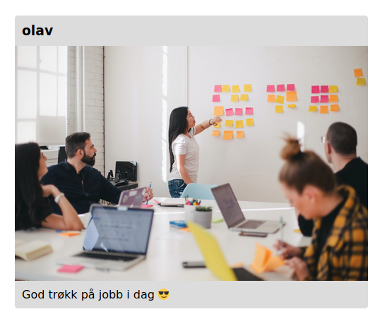

# HTML & CSS

## Emoji-guide

Du kommer til å se noen emojis i oppgavene. De betyr ca det her:

- :trophy: Oppgave: Her er hva du skal gjøre
- :bulb: Tips: Litt ekstra info som kan være greit å være for å løse en oppgave
- :rotating*light: Løsningsforslag: Her finner du en komplett gjennomgang av hvordan du \_kan* løse oppgaven

## Header

HTML-dokumenter inneholder en rekke elementer som enten er self closing, altså lukker seg selv; eller som har underelementer, ofte referert til som children.

Et element defineres med en tag. En tag ser slik ut `<tag>`. En tag markerer starten eller slutten på elementet, med innholdet i midten: `<tag>innhold</tag>`
Eventuelt er tagen self-closing: `<tag/>`

Det fins mange forkskjellige tags som har som oppgave å få siden til å se ut som man vil.

Vi har `<p>` for å definere avsnitt, `<h1>` for overskrifter (og h2, h3 osv. for mindre overskrifter), `<li>` for lister, og `<div>` for å definere områder innen HTMLkoden. Disse er bare noen få eksempler.

:trophy: Start et HTML dokument, og lag en overskrift som sier "Hello world!"

:bulb: Du kan skrive koden inn i `<body>` elementet i den inkluderte filen.

<details><summary>:rotating_light: Løsningsforslag</summary>
Body elementet ditt skal se sånn ut:

```html
<body>
  <h1>Hello World!</h1>
</body>
```

</details>

## Bilde

Bilder representeres med taggen `img` i HTML. Attributtet `src` forteller nettleseren hvor den kan hente bildet. I vårt tilfelle vil dette være en lokal fil.

```html

```

> Det er viktig å beskrive bilde med `alt` attributtet, slik at skjermlesere og andre verktøy kan presentere det riktig for brukeren.

:trophy: Legg til bildet `working.jpg`, som ligger i `img` mappen, i `index.html`.

<details><summary>:rotating_light: Løsningsforslag</summary>
Alle html-elementer kan ha attributter. Disse kan brukes til å gi tilleggsinformasjon om et element. I vårt tilfelle bruker vi `src` attributtet til å spesifisere den relative pathen til bildet.

```html

```

</details>

## Lag det vakkert med CSS :sparkles:

Okey, nå har vi en overskrift og et bilde. Elementene er der, men de skjer kanskje ikke så vakre ut.

En post på Bekkstagram består av hvem som har lastet den opp, et bilde og en beskrivelse av bildet. Dette kan representeres med html-koden nedenfor:

```html
<main>
  <h1>Bekkstagram</h1>
  <article class="post">
    <h3 class="author">olav</h3>
    
    <p class="description">
      God trøkk på jobb i dag
      <span role="img" aria-label="Emoji med solbriller">😎</span>
    </p>
  </article>
</main>
```

:trophy: Erstatt innholdet i body-elementet html-koden over og få det til å se ut som bildet under.

1. Sett en maks-bredde på innholdet og sentrer det på midten av siden (Du kan feks. style `main` elementet)
2. Fiks størrelsen på bildet. (Hint: Bredden på bildet er mer enn 100%)
3. Legg på bakgrunnsfarge, rund av hjørnene og legg til litt luft rundt tekstene.

:bulb: Fargen vi har brukt som bakgrunnsfarge heter `gainsboro`

:bulb: Man kan velge å style elementer med en gitt klasse. For eksempel kan man style bildet med klasse `image` med css'en under.

```css
.image {
  /* Din styling */
}
```



<details><summary>:rotating_light: Løsningsforslag</summary>

For å begrense bredden til elementer kan vi bruke `max-width`, la oss feks. begrense bredden til 500px. Det som er hakket mer magisk er at man kan sentrere et element horisontalt ved å sette høyre og venstre margin til `auto`.

```css
main {
  max-width: 500px;
  margin-left: auto;
  margin-right: auto;
}
```

Ved å sette bredden på bildet til å være 100% passer man på at det ikke blir for stort.

```css
.image {
  width: 100%;
}
```

Bakgrunnsfarge er ganske selvforklarende, men det er ikke `border-radius`. Man kan bruke verdien for å runde av hjørnene som i skjermbildet. For at tekstene ikke skal være helt i kanten av elementet kan man feks legge på 10px padding på alle sider (top, bunn, høyre, venstre).

> `padding: 10px;` er en kortere måte å definere padding på alle kanter av et element. Man kunne definert den for hver kant ved å skrive feks. `padding-left: 10px;` osv.

```css
.post {
  background-color: gainsboro;
  border-radius: 5px;
}

.author,
.description {
  padding: 10px;
}
```

</details>
